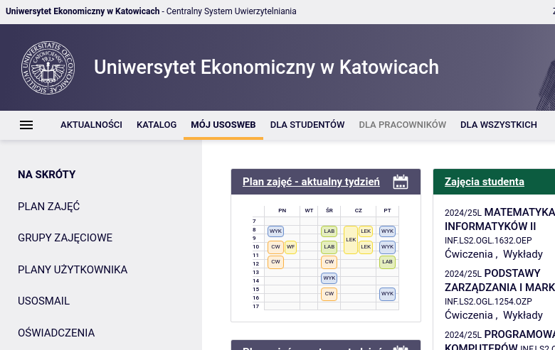

the code literaly logs in as you into usos to get your latest schedule

it doesn't requires password to read data already fetched, password is only needed to update date# UE kat USOS API

code for interaction with usos website directly since they don't feel like exposing api

it's not workaround usos website ,if the uni website is down (which is preatty common for whatever reason here) the thing will not work

the code literaly logs in as you into usos to get your latest schedule

it doesn't requires password to read data already fetched, password is only needed to update date

this thing is not backed by university and is bound to break at some point but is a good reference point for doing this kind of stuff
